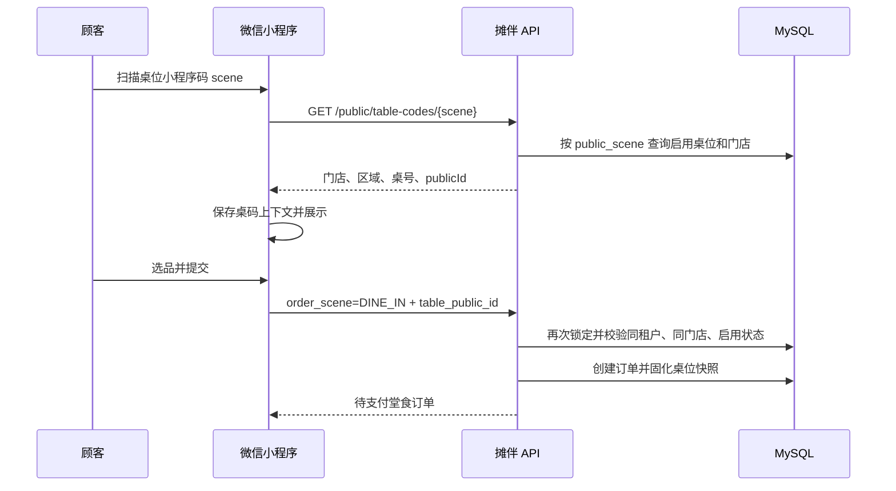

# 店内桌码、订单场景与打印模板设计

本文记录 2026-07-20 对 FirePOS 商户后台“店内 → 桌码管理 / 堂食订单 / 打印模板”的只读复核结果，以及摊伴一期的落地边界。

## 1. 对标系统观察

对标系统的桌码模型不是把租户、门店或数据库桌位 ID 直接放进二维码，而是给每张桌位生成一个独立 `scene`。当前账号可见的小程序路径形如：

```text
yb_wm/shop/in/goods?scene=358113
```

商户先维护区域、桌位类型和桌位：

- 区域：名称、排序、状态和桌位数量，例如“小院”；
- 桌位类型：名称、建议人数区间和状态，例如“小桌 / 1-3 人”；
- 桌位：区域、类型、桌号、状态和小程序入口，例如“小院 / 小桌 / A10”；
- 每张桌位可分别查看通用二维码和微信小程序码，也可以批量下载；
- 禁用桌位后，已有历史订单仍保留桌位快照，新扫码不能继续创建该桌订单。

堂食工作台按区域展示桌位，并区分未开台、已开台和就餐中。打印模板编辑器是公共能力，但模板会按外卖、外卖自提、退款、堂食和快餐等订单类型分别应用。因此“店内打印模板”和“外卖打印模板”可以是两个菜单入口，底层仍复用同一套模板引擎和数据表。

## 2. 摊伴一期业务模型

### 2.1 桌码

```text
租户 -> 门店 -> 区域 -> 桌位 -> public_scene
```

`public_scene` 使用随机、不可枚举、大小写精确匹配的公开短码。二维码只携带 scene，不携带可信 `tenant_id/store_id/table_id`。服务端解析 scene 后返回安全的门店和桌位展示信息。

一期支持：

- 区域新增、编辑、启停和排序；
- 桌位新增、编辑、启停、容量、备注和排序；
- 每个桌位独立的 scene、小程序路径与可下载二维码内容；
- 顾客扫码后在首页、菜单和结算页持续看到当前区域/桌号；
- 下单时由服务端再次校验 scene 对应的租户、门店和启用状态；
- 订单保存桌位 ID 以及区域、桌号、桌位编码快照。

一期不实现开台/清台、拼桌、多人共享购物车、桌台并单、餐中加菜和餐后统一结账。这些能力需要独立的 `dining_session` 聚合，不能仅靠给订单增加 `table_id` 冒充完成。

### 2.2 订单场景

订单统一使用独立的 `order_type`，不能从页面菜单或备注推断：

| order_type | 含义 | 一期状态 |
| --- | --- | --- |
| `DINE_IN` | 扫桌码堂食或商户堂食点单 | 支持；桌码入口必须绑定有效桌位 |
| `TAKEOUT` | 到店自取/摊位取餐 | 支持；不绑定桌位 |
| `DELIVERY` | 配送外卖 | 预留；菜单、筛选和打印模板可配置，但禁止创建配送订单 |

`order_type` 与支付状态、履约状态相互独立。订单一旦创建，不允许把自取订单改成桌码订单或把 A01 改成 A02；需要更换场景时关闭原订单并重新下单。

### 2.3 扫码与下单



小程序从 `App.onLaunch/onShow` 同时处理普通 query 与微信小程序码的 `scene`。切换到普通门店码时必须清理旧桌位上下文，失效或跨店 scene 必须停止下单并提示重新扫码，不能静默退化成另一张桌。

## 3. 分场景打印模板

商户菜单按业务语义分开：

- 店内 → 店内订单、桌码管理、店内打印模板；
- 外卖 → 外卖订单、外卖打印模板。

模板底层以 `tenant_id + store_id + business_type + template_type` 唯一定位。当前 `business_type` 包含 `DINE_IN/TAKEOUT/DELIVERY`，一期模板类型包含整单 `RECEIPT` 和逐品 `LABEL`；后续再扩展顾客联、厨房联和退款单。

创建打印任务时读取订单已经固化的 `order_type`，只选择相同业务类型的模板。整单小票按模板份数生成任务；商品标签按“订单明细 × 商品数量 × 模板份数”拆分，支持商品名、规格、选项、加料和单品备注。堂食模板还可使用 `{{table_area}}`、`{{table_name}}`；外卖模板未来再增加收货人、地址、配送方式等字段。外卖尚未开放不妨碍商户提前维护模板，但界面必须明确标注“暂未开放配送下单”。

门店设置中的“小票/标签自动打印”是输出类型总开关，关闭后所有经营场景都不再自动生成对应任务，但运营人员仍可明确发起补打。每个经营场景模板自己的 `trigger_event` 决定下单后还是付款后打印；门店的默认触发点只用于首次生成模板，避免全局设置覆盖已经单独配置的堂食、自提或外卖模板。

商户后台当前下载的是包含 `miniappPath` 的联调二维码。等正式小程序 `AppID/AppSecret` 配置完成后，平台还需接入微信 `getUnlimited`，将同一 `scene` 生成可直接唤起小程序的正式小程序码；在此之前界面不会把普通二维码冒充为正式微信小程序码。

## 4. 安全与一致性约束

- scene 为公开能力凭证，不使用自增 ID，也不接受客户端提供租户或门店归属；
- 解析和下单都检查桌位、区域、门店和租户状态；
- 订单查询与桌码管理接口都从商户 JWT 取得 `tenant_id`；
- 桌位改名、移动区域或停用不改写历史订单快照和历史小票；
- `DINE_IN` 没有有效桌位时拒绝下单，`TAKEOUT` 不允许夹带桌位；
- 一期拒绝 `DELIVERY` 创建，避免“菜单存在”等同于“业务已经可履约”。
