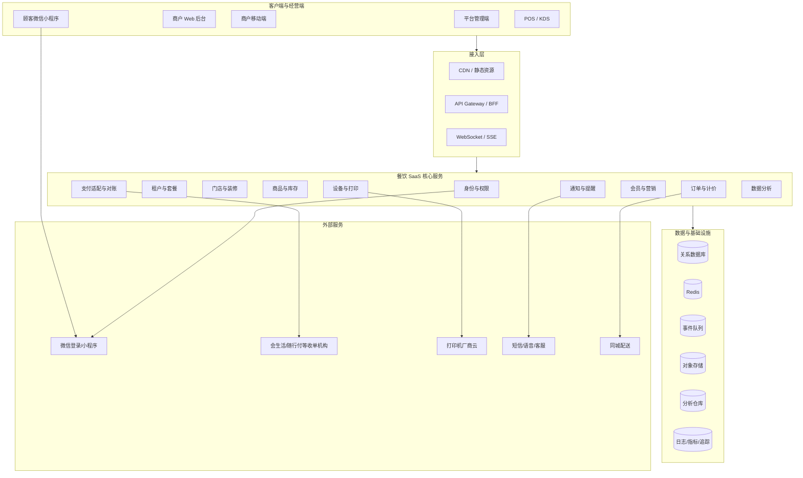
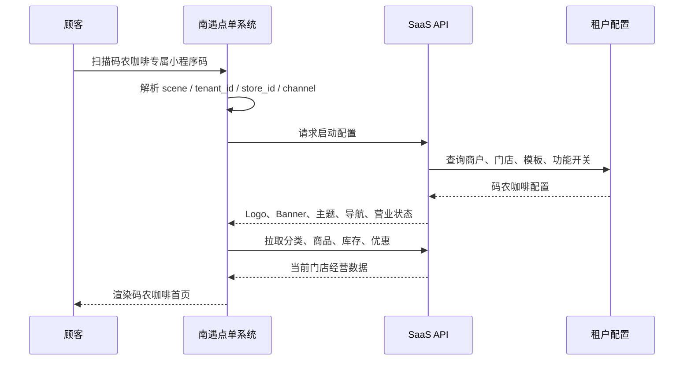
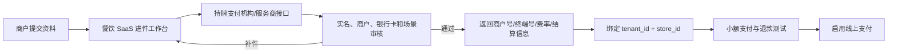
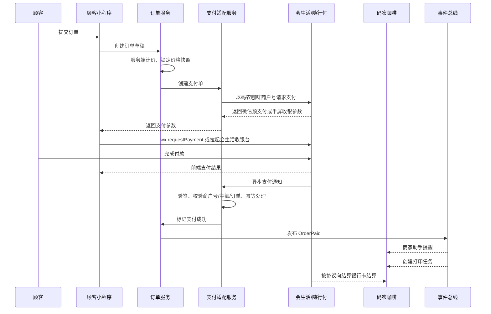
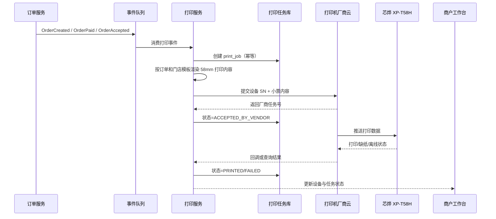

# 摊伴 TANBAN：多租户餐饮 SaaS 功能与技术设计

> 文档版本：v1.0
>
> 更新日期：2026-07-19
>
> 观摩样本：爨火餐饮系统商户后台、码农咖啡顾客点单小程序
>
> 目标读者：产品、设计、研发、测试、实施、运营、支付与硬件合作方

## 1. 文档目的

本文以一个真实商户“码农咖啡”为突破口，反向拆解其背后的餐饮 SaaS 产品形态，并形成一套可以指导“摊伴”正式研发的功能设计与技术设计。

本文不是对现有页面的简单抄录，而是区分三类内容：

1. **已实测事实**：从商户运营后台和顾客小程序中实际看到的功能。
2. **高可信推断**：由界面、业务行为和公开技术资料能够推导出的系统机制。
3. **建议设计**：正式开发“摊伴”时应补齐的产品、工程、安全和运维能力。

本文重点回答：

- 同类产品一般包含哪些端，客户端、服务端和第三方能力如何组成完整系统。
- “会生活收银台”在支付链路中的角色，餐饮 SaaS 是否经手资金。
- 通过打印机 SN 绑定并自动打印标签的技术原理，以及与蓝牙打印的区别。
- 一套可实施的多租户餐饮 SaaS 应具备哪些功能、数据模型、接口、状态机和工程保障。

---

## 2. 核心结论

### 2.1 产品形态

这类产品不是“三张页面”，而是一个由 **平台控制面、商户经营面、顾客交易面、设备执行面和第三方服务面** 组成的多租户系统。

最小可用版本通常包含四个业务端：

1. SaaS 平台管理端。
2. 商户 Web 运营后台。
3. 商户移动端/商家助手。
4. 顾客微信点单小程序。

完整商业版本通常还会增加：

5. 收银台/POS/KDS 后厨端。
6. 打印机、云喇叭等设备端。
7. 实施、代理商或支付进件工作台。

这些客户端背后共用一套多租户业务服务、数据存储、事件队列和第三方适配层。

### 2.2 小程序形态

码农咖啡不是一个独立注册、独立发布的小程序。实测结果表明：

- 小程序正式名称为 **“南遇点单系统”**。
- 小程序介绍为 **“爨火餐饮点单平台”**。
- 小程序内部首页、Banner、Logo、主题、商品和营销内容显示为 **“码农咖啡”**。

因此其高概率采用：

```text
统一微信小程序 AppID
  + 商家专属小程序码中的 scene/tenant_id/store_id
  + 商家装修配置
  + 商家商品与营销数据
  = 扫码后呈现码农咖啡专属店铺
```

### 2.3 支付形态

用户对“会生活收银台”的分析已经由商户协议、结算记录和银行卡入账记录验证：

- 餐饮 SaaS 负责商品、计价、订单、支付申请和支付结果后的履约。
- “会生活”是面向实体商户的收款、结算与交易管理工具；公开资料显示其运营方北京天阙科技与随行付关系密切，相关半屏支付方案走随行付收单通道。
- 码农咖啡签署了《随行付商户服务协议》，以特约商户身份完成支付进件，并绑定经营者个人银行卡作为结算卡。
- 交易按 0.38% 收取支付手续费，样本规则为包含节假日的 T+1，通常次日上午约 10 点到账。
- 银行卡入账对方显示“随行付支付有限公司备付金”，证明该样本由随行付直接向商户结算，资金不先进入餐饮 SaaS 自有账户，因此餐饮 SaaS **不经手资金**。
- 餐饮 SaaS 仍然必须安全处理支付单号、金额、商户号、异步回调、退款和对账，不能因为“不碰钱”就省略支付工程。

### 2.4 打印形态

“把打印机 SN 发给卖家，由卖家绑定到码农咖啡，下单或付款后自动打印”是典型的厂商云打印方案。码农咖啡使用芯烨 XP-T58H、Wi-Fi 联网，并可在商户 Web 后台选择触发节点：

```text
下单成功或支付成功（按门店配置）
  -> SaaS 创建打印任务
  -> SaaS 调用打印机厂商云 API，参数包含 SN 和打印内容
  -> 芯烨云将任务推送到已联网的 XP-T58H
  -> 打印机打印并回传/可查询状态
```

打印机通常通过 Wi-Fi、4G 或网线主动连接厂家云，不需要餐饮 SaaS 直接访问摊位局域网，更不是给每台打印机暴露公网 API。

需要注意：XP-T58H 的官方硬件分类是 58mm 云小票/外卖打印机，不是芯烨专用标签机。商户口中的“打签”属于业务叫法；正式工程中应把 `RECEIPT` 与 `PRODUCT_LABEL` 两类设备和模板分开。

---

## 3. 真实系统观摩记录

### 3.1 码农咖啡商户运营后台

实测后台标题为“码农咖啡-管理后台”，主要一级模块包括：

| 一级模块 | 主要能力 |
| --- | --- |
| 首页 | 营业额、订单、支付人数、转化、TOP 商品、设备与待办 |
| 外卖 | 订单处理、查询、自提、当面付、售后、配送、打印和提醒 |
| 店内 | 堂食、快餐、桌码、收银台、收银员、打印和码牌 |
| 商品 | 分类、商品、SKU、规格、属性、加料、标签、模板和库存 |
| 用户 | 顾客、标签、会员卡、等级、余额、积分和储值 |
| 财务 | 资产、交易、对账、退款和结算信息 |
| 装修 | 首页模板、全店风格、点单风格、导航、启动页和素材 |
| 数据 | 外卖、店内、当面付的订单、支付、商品分析 |
| 应用 | 优惠券、满减、储值、积分、签到、Wi-Fi、云喇叭等 |
| 设置 | 基础、员工、角色、支付、短信、提醒、打印机和打印模板 |

完整观摩清单已独立沉淀为 [《爨火 / FirePOS 商户运营后台菜单清单》](./REFERENCE_FIREPOS_MERCHANT_ADMIN_MENU.md)。2026-07-19 实时登录已逐一点击打开当前账号的 **10 个一级模块、88 个侧栏菜单入口**，对应 **82 个唯一 Hash 路由**；应用列表实时确认可见 **29 个功能卡片**，卡片路由及部分内部子菜单则由公开前端包或用户截图补充。当前账号不可见的候选能力被隔离标记为“能力超集”，不与实时清单混算。

菜单被记录只表示对标系统存在该入口，不构成摊伴一期实现承诺。摊伴的实际范围仍按本文件第 6、10 和 14 章的功能设计、技术边界与迭代计划确定。

这说明该产品是完整的经营 SaaS，而不是只有“扫码下单”的表单工具。

### 3.2 码农咖啡顾客小程序

### 首页

- 商户名称、Logo、咖啡主题 Banner。
- 堂食点单、门店自取、外送到家。
- 会员中心、充值有礼、优惠券。
- 微信咨询二维码。
- 平台页脚“爨火餐饮系统”。

### 点单

- 推荐商品、分类导航、商品图片和价格。
- 自提/外卖模式切换。
- 商品详情、购物车和去下单。
- SKU 选择：常温、热、冰、少冰去冰。
- 甜度选择：无糖、少糖、多糖。
- 商品数量选择。

### 订单

- 今日订单、历史订单。
- 外卖、堂食、快餐、当面付、排队、预约分类。

### 个人中心

- 余额、积分、优惠券、会员卡。
- 我的地址、我的订单、充值中心。
- 领券中心、签到中心、积分商城。
- 会员中心、门店 Wi-Fi、联系客服。

### 当前租户配置状态

- 外卖入口当前不可用或未完整配置。
- 商家公告为空。
- 会员页仍有“会员卡名称”等默认占位内容。
- 签到功能已关闭。
- Wi-Fi 信息未配置。
- 积分商城暂无商品。
- 充值中心已开启，支持固定金额和自定义金额。
- 领券中心配置了“满 20 减 2”和“满 60 享 9 折”。

这些现象进一步证明：平台提供统一能力，商户通过功能开关和配置决定哪些功能真正可用。

### 3.3 会生活商户端与结算实测

用户补充的会生活截图和访谈信息确认了以下事实。文档对商户号、银行卡号和设备 SN 只保留脱敏形式：

| 证据 | 已确认事实 |
| --- | --- |
| 点单系统卖家介绍 | 小程序交易手续费为 0.38%；100 元交易净到账 99.62 元；资金次日结算至商户银行卡 |
| 支付协议页面 | 商户签署的是《随行付商户服务协议》；协议包含受理终端、结算账户、风险交易冻结、凭证留存等要求 |
| 会生活商户首页 | 码农咖啡可查看今日营业额、交易笔数、生意报表、实时账本、结算通知、员工、门店和收款设备 |
| 账号管理 | 码农咖啡拥有独立的 15 位商户编号，截图中按 `3992*********281` 脱敏记录 |
| 收款设备 | 会生活内另有一个收款码设备 SN，支持收款码、云音箱、物联网卡续费；它不是芯烨打印机 |
| 结算记录 | 前一交易日费用 0.22 元，净结算 57.78 元，约次日上午 09:44 结算成功；反推交易原金额为 58 元，费率正好约 0.38% |
| 银行卡入账 | 入账对方为“随行付支付有限公司备付金”，交易类型为银联入账 |

访谈进一步确认：

- 结算卡是商家经营者个人银行卡。
- 包含节假日的每日 T+1，通常上午 10 点前后到账。
- 费率固定为交易金额的 0.38%，节假日不变。
- 会生活首页、消息页和“我的”页共同承担收款播报、账本、结算、账号、门店、员工与设备管理。

这组证据把原先的“支付机构直结推断”升级为对码农咖啡样本的已确认事实。

---

## 4. 产品端与系统结构

### 4.1 端的划分

### A. SaaS 平台管理端

使用者：平台运营、销售、实施、客服、财务、技术运维。

职责：管理租户、套餐、权限、版本、支付进件、设备、工单、风险与平台经营数据。

### B. 商户 Web 运营后台

使用者：老板、店长、运营、财务、商品管理员。

职责：门店经营配置、商品、订单、会员、营销、装修、财务、员工、打印机和数据分析。

### C. 商户移动端/商家助手

形态：微信商家端小程序、App 或 PWA。

职责：新订单提醒、接单、出餐、退款审核、估清、营业开关、设备状态和今日经营数据。

对于夜市咖啡摊，移动端比桌面后台更关键，因为商户不一定长期使用电脑。

### D. 顾客微信点单小程序

职责：扫码识别门店、浏览商品、选规格、结算、支付、取餐、查单、会员与营销。

### E. 收银台/POS/KDS 端（可选）

- POS：店员代客下单、扫码枪、现金记账、当面付。
- KDS：后厨/吧台制作队列、叫号、出餐。
- 可先由商户移动端和打印标签替代，后续再独立建设。

### F. 设备端

- 云小票打印机和云标签打印机。
- 云小票打印机。
- 云喇叭/语音播报设备。
- 电子价签、取餐屏、叫号屏等扩展设备。

### G. 实施/代理商工作台（规模化后需要）

- 商户资料收集与进件状态。
- 小程序装修交付。
- 支付通道开通。
- 打印机 SN 绑定和测试。
- 商户培训、续费与售后。

### 4.2 总体架构



### 4.3 控制面与交易面

建议将系统逻辑分成两类：

- **控制面**：商户、套餐、权限、装修模板、支付进件、设备绑定、功能开关。
- **交易面**：商品查询、计价、订单、支付回调、库存、打印、通知和对账。

控制面允许分钟级最终一致；交易面要求秒级处理、幂等、可追踪和故障恢复。

### 4.4 多租户小程序加载机制



二维码 `scene` 建议至少包含一个不可枚举的短码，后端再映射到：

- `tenant_id`
- `store_id`
- `table_id`（桌码场景）
- `channel`（堂食、自取、外卖、推广）
- `campaign_id`（活动归因）

不要直接信任客户端传入的租户和价格数据。

---

## 5. 角色与权限设计

| 角色 | 典型权限 |
| --- | --- |
| 平台超级管理员 | 全平台配置、租户停启用、系统版本和审计 |
| 平台实施 | 商户开通、装修、支付进件、设备绑定，不可查看无关财务敏感信息 |
| 平台客服 | 工单、订单只读、设备诊断、有限代操作 |
| 商户老板 | 本租户全部门店和财务权限 |
| 店长 | 指定门店订单、商品、员工、营销和设备 |
| 收银员 | 下单、收款状态、退款申请、交接班 |
| 制作员 | 制作队列、打印、出餐、估清 |
| 商户财务 | 交易、退款、对账、结算和导出 |
| 顾客 | 自己的订单、地址、会员、优惠券和余额 |

权限模型采用 RBAC + 数据范围：

- `role -> permission`
- `staff -> role`
- `staff -> tenant/store scope`

任何商户数据查询都必须由服务端注入 `tenant_id`，不能只依赖前端传参。

---

## 6. 功能设计

### 6.1 SaaS 平台管理端

### 经营总览

- 新增、活跃、流失商户。
- 在线门店、今日订单、平台交易规模。
- SaaS 订阅收入、续费率、套餐分布。
- 支付成功率、回调延迟、退款异常。
- 打印机在线率、失败任务和告警。
- 小程序活跃用户、扫码转化和功能使用分布。

### 商户与门店

- 商户创建、主体类型、合同、联系人和服务商归属。
- 门店/摊位、营业地址、时区、营业时间和渠道。
- 冻结、恢复、注销和数据导出。
- 商户实施进度：资料、支付、装修、商品、打印、试单、上线。

### 套餐与计费

- 套餐、功能权益、用量、门店数和员工数限制。
- 试用、订阅、续费、升级、降级、欠费和宽限期。
- 支付/打印等外部能力的成本与加价配置。

### 小程序与模板

- 平台小程序 AppID 和版本管理。
- 首页、点单、个人中心模板。
- 灰度发布、回滚、兼容性和最低版本。
- 商户小程序码批量生成、下载和渠道归因。

### 支付服务管理

- 支付通道、服务商配置和路由策略。
- 商户进件、补件、审核、启用、冻结。
- 商户号/终端号与门店映射。
- 费率、结算周期、结算卡变更状态。
- 支付回调、退款、差错和对账文件。

### 设备管理

- 厂商账号、设备型号、SN、KEY、网络类型。
- 绑定租户/门店/打印场景。
- 在线、离线、缺纸、SIM 到期和队列积压。
- 测试打印、重新绑定、替换设备和审计记录。

### 工单与风控

- 实施工单、售后工单、支付异常、设备故障。
- SLA、升级、内部备注、商户可见回复。
- 登录异常、越权访问、退款异常和高频试单告警。

### 6.2 商户运营后台

### 今日经营

- 营业额、订单、客单价、支付人数、新客、复购。
- 待接单、制作中、待取餐、退款/售后。
- 热销商品、库存预警和设备状态。

### 订单工作台

- 堂食、自取、外卖、快餐、当面付、预约。
- 接单、拒单、制作、完成、叫号、退款申请。
- 订单搜索、导出、补打、重打和备注。
- 订单提醒：微信、语音、云喇叭、打印。

### 商品与库存

- 分类、商品、SKU、规格、加料、单位和标签。
- 温度、甜度等规格模板。
- 渠道价格、会员价、上下架、推荐、售罄。
- 库存总量、出摊库存、扣减和盘点流水。
- 标签打印模板和商品打印路由。

### 顾客与会员

- 顾客画像、消费记录、标签和黑名单。
- 会员等级、权益、积分、余额、储值。
- 余额和积分必须使用不可篡改的流水账模型。

### 营销

- 优惠券、满减、折扣、新客券、会员日。
- 储值赠送、积分签到、积分商城。
- 活动效果、成本、核销和滥用控制。

### 装修

- 模板选择、Banner、Logo、主题色、首页模块。
- 导航、启动页、客服二维码和门店公告。
- 草稿、预览、发布、历史版本和回滚。

### 财务

- 订单交易、退款、支付通道、手续费。
- 订单金额与支付金额核对。
- 支付机构结算单与银行卡入账核对。
- 日结、差异、异常处理和导出。

### 6.3 商户移动端

- 新订单强提醒和快捷接单。
- 制作中、待取餐、完成、退款审核。
- 商品估清、库存调整、营业开关。
- 打印机在线状态、补打和测试打印。
- 今日营业额、订单、热销商品。
- 支付到账播报可由会生活商家端承担，订单状态仍以 SaaS 为准。

### 6.4 顾客小程序

### 启动与门店识别

- 扫码进入对应商户、门店和业务渠道。
- 营业状态、距离、公告、预计制作时间。
- 过期码、停业、门店不存在的降级页。

### 商品与购物车

- 分类、搜索、推荐、规格、加料和库存。
- 购物车数量、优惠明细、备注和预计完成时间。
- 价格由服务端重新计算，客户端只展示。

### 结算

- 堂食桌号、自取手机号/取餐名、外卖地址。
- 优惠券、余额、积分等组合规则。
- 创建订单草稿、价格快照和支付单。

### 支付与结果

- 拉起支付插件/半屏小程序。
- 用户回到小程序后主动查单。
- 只有服务端支付回调或主动查单确认成功后，订单才能进入已支付。
- 支付处理中显示“正在确认”，不能直接判失败让用户重复支付。

### 订单与会员

- 取餐码、制作进度、退款进度、再来一单。
- 余额、积分、等级、优惠券、充值和记录。

---

## 7. 核心业务状态机

### 7.1 订单状态

```text
DRAFT 草稿
  -> PENDING_PAYMENT 待支付
  -> PAID 已支付
  -> ACCEPTED 已接单
  -> PREPARING 制作中
  -> READY 待取餐/待配送
  -> COMPLETED 已完成

PENDING_PAYMENT -> CLOSED 超时关闭（门店禁止迟付）
PENDING_PAYMENT -> PENDING_PAYMENT 超时归还库存（门店允许迟付；再次付款先重新预占）
PAID/ACCEPTED -> REFUNDING 退款中 -> REFUNDED 已退款
PAID/ACCEPTED -> CANCELLED 已取消（需保留退款关系）
```

订单状态与支付状态必须分开，不能使用一个字段同时表达两者。

### 7.2 支付状态

```text
INIT -> PROCESSING -> SUCCESS
                   -> FAILED
                   -> CLOSED
SUCCESS -> PARTIAL_REFUND / FULL_REFUND
```

### 7.3 打印任务状态

```text
PENDING -> SENDING -> ACCEPTED_BY_VENDOR -> PRINTED
                   -> RETRY_WAIT
                   -> FAILED
                   -> CANCELLED
```

“厂商 API 接收成功”不等于“纸已经打出”，必须区分 `ACCEPTED_BY_VENDOR` 和 `PRINTED`。

---

## 8. 支付专题：会生活收银台

### 8.1 对用户分析的判断

**判断：对码农咖啡这个样本已经确认正确。**

公开资料与商户证据共同确认：

1. 会生活定位为实体商户移动收款、结算、账单和交易管理工具。
2. 会生活隐私政策明确提及商户营业执照、法人/负责人身份证、银行账户、结算银行卡、交易和结算信息。
3. 公开的餐饮系统半屏支付接入说明要求小程序添加“会生活”插件和“会生活生活收银”半屏小程序，并由服务商在随行付机构后台申请配置。
4. 该说明明确消费者支付界面会显示“会生活收银提供服务”。
5. 码农咖啡实际签署《随行付商户服务协议》。
6. 会生活展示独立商户编号、结算记录和绑定结算卡。
7. 银行卡入账对方为“随行付支付有限公司备付金”。
8. 商户观察到的结算规则为每日 T+1、包含节假日、次日上午约 10 点到账。
9. 天阙开放平台公开文档确认存在合作方商户进件、聚合支付、支付查询/通知、部分退款、退款查询/通知和终端报备接口。

因此可以确认：爨火点单平台负责订单和支付技术编排，随行付负责实际收单与向码农咖啡结算，码农咖啡是经营和收款主体。

仍需在正式接入商务和接口阶段确认：

- 餐饮 SaaS 是否从支付手续费中获得技术服务分润。
- 退款资金来源和手续费退还规则。
- 当前对标系统采用公开的天阙统一下单 API，还是另行开通的“会生活生活收银”半屏/插件产品。

文档和日志中不得保存截图里的完整商户编号、银行卡号、收款设备 SN 或手机号。

### 8.2 参与方

| 参与方 | 职责 |
| --- | --- |
| 顾客 | 在小程序下单并支付 |
| 餐饮 SaaS | 创建业务订单、计算金额、请求支付、接收回调、推进履约 |
| 会生活/北京天阙 | 商户侧收款、结算和交易管理产品/技术载体 |
| 随行付等持牌机构 | 特约商户管理、收单、风险管理和资金结算 |
| 微信支付等支付渠道 | 顾客支付工具和支付能力 |
| 码农咖啡 | 实际经营者、商品提供方和结算收款方 |

### 8.3 商户进件

建议的正式进件流程：



可能需要的材料包括：

- 营业执照或小微商户适用材料。
- 法人/负责人/结算人身份证件。
- 结算银行卡及开户人信息。
- 门头、经营场景、收银台照片。
- 联系电话、经营地址、经营类目。
- 小程序名称、AppID、支付场景说明。

正式产品不应要求销售人员长期在个人微信中保存身份证和银行卡照片。应提供加密上传、最小可见、下载水印、访问审计、到期清理和直接传给支付机构的流程。

#### 8.3.1 合作方接入与商户号的区别

公开接口并不是“拿到一个商户号即可调用”。摊伴需要先以合作方/服务商身份获得平台级 `orgId`，生成 RSA 密钥对并与天阙交换公钥；每个商户审核通过后，再获得独立的 15 位 `mno`。请求由合作方私钥签名，返回与通知使用天阙公钥验签。

商户进件支持两种模式：

1. `TQM001/TQM002/TQM004/TQM020` 等 API 上传资料、提交进件、查询和接收审核通知。
2. 获取天阙托管进件页面，由商户在官方页面填写，利用其 OCR、工商和结算信息校验能力。

一期优先采用托管进件页面，避免摊伴长期保存身份证、银行卡照片等敏感原件；获得正式商务权限后再评估 API 进件。

### 8.4 支付时序



### 8.5 餐饮 SaaS 是否“不过钱”

对码农咖啡样本，现有证据已满足以下条件，因此可以确认 SaaS 不经手消费者资金：

- 支付请求使用码农咖啡对应的特约商户号。
- 支付服务协议中的商户/收款方是码农咖啡实际经营主体。
- 支付机构直接向码农咖啡结算银行卡结算。
- 资金不先进入 SaaS 公司账户再二次转付。
- SaaS 仅收取软件订阅费或由支付机构按合规协议结算技术服务费。

资金流可以概括为：

```text
顾客支付
  -> 微信/银联等支付链路
  -> 随行付支付有限公司
  -> 随行付备付金结算
  -> 码农咖啡经营者绑定银行卡
```

餐饮 SaaS 持有的是业务订单账和支付状态，不持有待提现的商户资金余额。会生活商户端展示的账户资产、实时账本和结算记录属于支付机构侧账本视图。

如果平台先统一收款，再按内部账本向商户提现，性质完全不同，会显著提高资金、支付和平台合规风险。

### 8.5.1 公开 API 对小程序支付的约束

天阙 `TQP003 聚合支付（统一下单）`用于公众号/小程序商城。微信小程序场景需要提交：

- `mno`：码农咖啡对应的随行付商户号。
- `ordNo`、`amt`：摊伴支付单号与服务端计算金额。
- `payType=WECHAT`、`payWay=03`。
- `subAppid`：摊伴统一小程序 AppID。
- `userId`：顾客在该小程序下的 OpenID。
- `notifyUrl`：摊伴服务端支付通知地址。

天阙返回微信预支付参数后，小程序调用 `wx.requestPayment`。所以“不经手资金”不代表“不关心支付渠道”：摊伴不直连微信支付商户平台，但仍负责微信登录、OpenID、统一下单和支付控件调用。

`TQP037 聚合包装主扫`可以生成动态 `payUrl`，并允许不预先指定支付渠道，更适合桌牌、POS 或第二台设备扫码，不适合同一手机已经打开小程序后的结算主流程。

### 8.6 回调、查单和幂等

支付服务必须：

- 校验签名、时间戳、商户号、订单号、币种和金额。
- 使用支付渠道交易号作为唯一约束。
- 重复回调返回成功，但不得重复推进订单、扣库存、发券或打印。
- 前端返回成功后仍主动查单，防止异步通知延迟。
- 对“顾客已付款但 SaaS 未确认”建立自动补偿任务。

天阙公开规则进一步确认：成功交易通过 `TQP005` 异步通知；通知未得到规定成功响应时最多重试 10 次；失败交易不会依赖成功通知返回，因此待支付/支付中订单必须用 `TQP004` 主动查询，不能只等回调。

建议幂等键：

```text
payment_request: tenant_id + order_no + payment_attempt_no
payment_callback: provider + provider_transaction_id
order_paid_event: order_id + paid_version
refund_request: payment_id + refund_request_no
```

### 8.7 对账

至少进行三方核对：

1. SaaS 业务订单账。
2. 支付机构交易账。
3. 支付机构结算账/商户银行卡入账。

差异类型包括：

- 支付成功但业务订单未成功。
- 业务订单显示成功但渠道无交易。
- 金额或手续费不一致。
- 退款状态不一致。

### 8.8 部分退款

天阙 `TQP006`允许对 180 天内的成功交易发起多次部分退款，只要累计退款金额不超过原支付金额。退款必须使用独立且不重复的商户退款单号，并通过 `TQP007` 查询或 `TQP036` 异步通知确认最终状态。

因此商户后台可以采用“输入本次退款金额”的交互，但服务端必须在事务中锁定支付记录，计算“已成功退款 + 退款中金额”，禁止并发超退；`REFUNDING` 不得提前视为成功。
- 已交易但未进入结算。

### 8.8 T+1 的准确表述

码农咖啡已确认采用包含节假日的每日 T+1 自动结算，通常次日上午约 10 点到达绑定的经营者个人银行卡。两张不同样本分别显示 09:44 左右结算成功和 09:41 左右银行卡入账，能够支持“上午 10 点前后到账”的观察，但不能把两张记录视为同一笔交易。

但这应作为该商户的支付通道配置保存，不能硬编码为全平台承诺。其他商户仍可能因合同、风险控制、交易时间或银行卡状态使用不同结算周期。

### 8.9 费率与结算金额

码农咖啡费率为 0.38%，属于交易手续费，不是另外收取的提现手续费：

```text
交易原金额 gross_amount       = 100.00
交易手续费 transaction_fee   = 100.00 × 0.38% = 0.38
净结算金额 net_amount         = 99.62
额外结算手续费 settlement_fee = 0.00
```

结算截图中的另一笔数据同样吻合：原交易金额 58.00 元，交易手续费约 0.22 元，净结算 57.78 元。

推荐将费率保存为基点 `fee_rate_bps=38`，金额计算全部使用最小货币单位整数并固化舍入规则。订单账、支付账和结算账分别记录原金额、交易手续费、净结算额和额外结算手续费，不能只保存一个 `amount`。

---

## 9. 打印专题：蓝牙、局域网与厂商云

### 9.1 三种方案比较

| 方案 | 链路 | 优点 | 缺点 | 适合场景 |
| --- | --- | --- | --- | --- |
| 手机蓝牙打印 | 手机/商家小程序 -> BLE -> 打印机 | 便携、无需打印机联网、成本低 | 手机必须在场且保持连接；权限和兼容性复杂；自动化弱 | 临时摊位、备用打印 |
| 本地网关打印 | SaaS -> 商户助手/本地代理 -> USB/LAN 打印机 | 可使用大量普通打印机；控制强 | 需要电脑/盒子/常驻 App；安装运维重 | 固定门店、已有收银机 |
| 厂商云打印 | SaaS -> 厂商云 API -> Wi-Fi/4G 打印机 | 自动、远程、无需手机常驻、易做设备状态 | 依赖厂商云和网络；有设备/流量/API成本 | 夜市咖啡摊、外卖、无人值守接单 |

码农咖啡现有主设备已经确认为 **芯烨 XP-T58H Wi-Fi 云打印机**。正式方案以芯烨云自动打印为主；只有在同时确认具体硬件接口和实现商户端 BLE 驱动后，才把蓝牙作为应急备份。

### 9.2 “SN 绑定”的真实含义

码农咖啡实际打印设备已确认具备机身 SN 和二维码，通过 Wi-Fi 联网。芯烨官方资料显示 XP-T58H 为 58mm 云小票/外卖打印机，支持芯烨云、本地/云端打印、语音播报，打印宽度 48mm、203DPI、速度 120mm/s。

芯烨云官方开放文档明确要求：

- 开发者先取得厂商开发者账号和密钥。
- 打印前将打印机 SN/PID，以及部分厂商要求的设备 KEY，添加到开发者账户。
- 调用小票或标签打印接口时传入 SN。
- 可以查询打印任务状态、打印机在线状态和待打印数量。

因此卖家收到打印机 SN 后执行的是两层绑定：

```text
打印机厂商云账号
  └── XP-T58H 的 SN/PID 注册到芯烨云开发者账户

餐饮 SaaS 数据库
  └── SN -> tenant_id=码农咖啡 -> store_id=当前摊位 -> 打印模板
```

安全设计上不应只依赖公开可见的 SN；芯烨云开发者账号密钥或厂商侧授权也必须参与校验。设备 SN 在运营页面中应默认脱敏。

会生活截图中还存在一个独立的“收款码设备 SN”，它属于支付收款设备，不是芯烨打印机。技术模型必须将 `payment_device` 与 `print_device` 分开，不能因为两者都有 SN 就复用同一张设备表。

### 9.3 云打印架构



### 9.4 什么时候创建打印任务

码农咖啡后台已确认支持两种触发点：

- 下单后打印：消费 `OrderCreated`，适用于到店后付款、当面付或商户愿意承担未付款废单的场景。
- 付款后打印：消费 `OrderPaid`，适用于小程序在线支付，能够避免未付款订单进入制作。

完整产品仍可扩展：

- 手动接单后打印：消费 `OrderAccepted`。
- 标签逐杯打印：每个商品、每个数量生成一张标签。
- 小票打印：每个订单生成一张或多张小票。
- 退款/取消：可打印作废条或只在屏幕提醒。

码农咖啡当前模式建议默认选择“付款后打印”。若选择“下单后打印”，打印内容必须醒目标识 `待付款`，订单取消时还需提供作废提醒。

### 9.5 小票模板与标签模板

XP-T58H 是 58mm 云小票机，正式接入应使用 `ORDER_RECEIPT` 模板，基础物理参数为 57.5mm 纸宽、约 48mm 有效打印宽度、203DPI。它不是芯烨开放平台所列的专用标签机，因此不能直接套用有间隙标签纸的标签 API。

如果商家把打印结果称为“打签”，可能是把商品制作信息打印在连续热敏纸或连续不干胶上。若要使用有固定宽高和间隙的模切杯贴，应另选芯烨标签机，并使用 `PRODUCT_LABEL` 模板。

两类模板都不是普通 HTML 页面，需考虑打印机语言和物理参数：

- 纸张宽、高、间隙、方向和打印浓度。
- 店铺名、订单号、取餐号、下单时间。
- 商品名、规格、温度、甜度、加料和备注。
- 杯序号，例如 `2/3`。
- 堂食/自取/外卖标识。
- 条形码或二维码。
- 中文字体、图片栅格化和 DPI。

XP-T58H 建议数据结构：

```json
{
  "templateType": "ORDER_RECEIPT",
  "paper": { "widthMm": 57.5, "printableWidthMm": 48, "dpi": 203 },
  "copiesRule": "ORDER",
  "fields": [
    "store_name",
    "pickup_no",
    "product_name",
    "sku_options",
    "modifiers",
    "item_remark",
    "item_quantity",
    "ordered_at"
  ]
}
```

服务端应先生成厂商无关的 `PrintDocument`，再由各厂商适配器转换成 ESC/POS、TSPL、CPCL 或厂商专用标记语言。XP-T58H 在数据模型中应标记为 `device_type=RECEIPT`。

### 9.6 打印可靠性

必须处理：

- 打印机离线、缺纸、开盖、网络中断。
- 打印机流量卡过期。
- SN 已绑定其他厂商账号。
- 厂商 API 超时或限流。
- API 已接收但未实际打印。
- 重试造成重复小票或标签。
- 商户手动补打和重打审计。

码农咖啡后台已确认存在补打功能，说明系统至少保存了订单与打印任务的关联关系。正式设计还需补齐补打次数、操作人、原因和原厂任务号审计。

建议策略：

- `print_job` 建立唯一幂等键，例如 `order_id/order_item_id + print_scene + template_version`。
- 指数退避重试并设置最大次数。
- 厂商任务号持久化。
- 超过阈值进入死信队列和人工处理。
- 重打必须生成新的 `reprint_no` 并记录操作人和原因。
- 商户端显示在线状态、最后心跳、失败原因和待打印数。

### 9.7 蓝牙打印实现边界

微信小程序蓝牙打印通常使用 BLE：

1. 商户手机扫描设备。
2. 建立 BLE 连接。
3. 发现可写特征值。
4. 将标签指令或图片切块写入设备。
5. 等待打印完成或由用户确认。

限制：

- 依赖手机权限、距离和前台运行。
- iOS/Android 的 MTU、分包和后台行为不同。
- 大图片和复杂标签传输慢。
- 无法保证无人值守自动打印。

因此蓝牙更适合作为“手动补打/应急打印”，不应是 SaaS 自动接单的唯一链路。

---

## 10. 服务端技术设计

### 10.1 架构策略

首版采用 **模块化单体 + 事件队列**，不要一开始拆成大量微服务。

原因：

- 订单、支付、库存和营销规则高度关联。
- 小团队更需要事务边界清晰和快速交付。
- 支付回调、打印和通知可以先作为独立 Worker 扩容。

推荐工程结构：

```text
apps/
  platform-web/          SaaS 平台管理端
  merchant-web/          商户运营后台
  merchant-assistant/    商户移动端/PWA/小程序
  wechat-miniprogram/    顾客微信小程序
  api/                   HTTP API / BFF
  worker/                支付回调、打印、通知、对账任务

modules/
  identity/
  tenant-subscription/
  store-decoration/
  catalog-inventory/
  pricing-promotion/
  order/
  payment-reconciliation/
  printing-device/
  customer-membership/
  notification/
  analytics/

packages/
  domain-types/
  event-contracts/
  payment-adapters/
  printer-adapters/
  design-system/
  observability/
```

当订单量、团队和发布节奏增长后，再优先拆出支付、打印通知和数据分析服务。

### 10.2 核心模块

| 模块 | 主要职责 |
| --- | --- |
| Identity | 微信登录、员工账号、Token、RBAC、数据范围 |
| Tenant | 商户、门店、套餐、能力开关、实施状态 |
| Store | 营业设置、渠道、桌码、装修、素材和小程序码 |
| Catalog | 分类、商品、SKU、规格、加料、价格和上下架 |
| Inventory | 库存、估清、预占、扣减、盘点和流水 |
| Pricing | 服务端计价、优惠券、满减、会员价和价格快照 |
| Order | 订单创建、状态机、售后、取餐码和履约 |
| Payment | 通道路由、支付单、回调、退款、查单和对账 |
| Printing | 设备绑定、模板、打印任务、厂商适配和重试 |
| CRM | 顾客、会员、余额、积分、储值和标签 |
| Notification | 订阅消息、商户提醒、短信、语音和客服 |
| Analytics | 经营指标、渠道、商品、用户和活动效果 |

### 10.3 数据存储

- MySQL/PostgreSQL：业务主数据和交易数据。
- Redis：会话、限流、短期缓存、分布式锁和取餐号计数。
- 对象存储：商品图、Banner、进件材料和导出文件。
- 消息队列：订单支付、打印、通知、库存和分析事件。
- OLAP/数仓：经营分析，不直接压业务主库。
- 日志与追踪：支付、打印和跨服务链路定位。

### 10.4 核心数据模型

#### 租户与组织

- `tenant`
- `store`
- `stall_session`
- `subscription`
- `plan`
- `feature_entitlement`
- `staff`
- `role`
- `permission`

#### 小程序与装修

- `mini_program_app`
- `mini_program_release`
- `scene_code`
- `store_theme`
- `page_template`
- `page_module_config`
- `media_asset`

#### 商品与库存

- `category`
- `product`
- `sku`
- `option_group`
- `option_value`
- `modifier_group`
- `inventory`
- `inventory_ledger`

#### 订单与支付

- `order`
- `order_item`
- `order_price_snapshot`
- `order_status_history`
- `payment`
- `payment_attempt`
- `payment_callback_log`
- `payment_device`
- `refund`
- `settlement_record`
- `reconciliation_diff`

#### 打印与设备

- `device_vendor`
- `print_device`
- `device_binding_history`
- `print_template`
- `print_job`
- `print_job_attempt`
- `vendor_callback_log`

#### 顾客与营销

- `customer`
- `member`
- `member_level`
- `balance_ledger`
- `points_ledger`
- `coupon`
- `customer_coupon`
- `promotion`
- `promotion_redemption`

所有经营数据必须有 `tenant_id`；门店数据同时有 `store_id`。交易表不使用可覆盖余额，而使用流水汇总得到余额。

### 10.5 关键字段示例

#### payment

```text
id
tenant_id
store_id
order_id
provider                  suixingpay / wechatpay / other
provider_merchant_id
provider_terminal_id
provider_transaction_id
gross_amount_minor
fee_rate_bps             码农咖啡样本为 38
transaction_fee_minor
net_settlement_amount_minor
settlement_fee_minor
currency
status
settlement_cycle
paid_at
raw_callback_ref
created_at / updated_at
```

#### settlement_record

```text
id
tenant_id
store_id
provider                    suixingpay / other
provider_merchant_id
settlement_batch_no
settlement_date
gross_amount_minor
transaction_fee_minor
net_settlement_amount_minor
settlement_fee_minor
settlement_card_last4
counterparty_name           样本为随行付支付有限公司备付金
status
initiated_at
settled_at
created_at / updated_at
```

#### payment_device

```text
id
tenant_id
store_id
provider                  suixingpay / other
provider_merchant_id
provider_device_sn_ciphertext
device_type               QR_CODE / CLOUD_SPEAKER / POS / OTHER
status
bound_at
```

#### print_device

```text
id
tenant_id
store_id
vendor                    xpyun / feie / other
device_type               LABEL / RECEIPT
model                      码农咖啡样本为 XP-T58H
sn_ciphertext
device_key_ciphertext
network_type              WIFI / 4G / LAN / BLE
purpose                   BAR / KITCHEN / CASHIER
status
last_heartbeat_at
bound_at
```

#### print_job

```text
id
tenant_id
store_id
device_id
order_id
order_item_id
template_id
scene
idempotency_key
vendor_job_id
status
attempt_count
last_error_code
last_error_message
printed_at
created_at / updated_at
```

### 10.6 API 设计示例

### 顾客端

```text
GET  /v1/mini/launch-config?scene=...
GET  /v1/stores/{storeId}/catalog
POST /v1/orders/quote
POST /v1/orders
POST /v1/orders/{orderId}/payments
GET  /v1/orders/{orderId}
POST /v1/orders/{orderId}/refund-requests
```

### 商户端

```text
GET   /v1/merchant/orders
POST  /v1/merchant/orders/{orderId}/accept
POST  /v1/merchant/orders/{orderId}/ready
POST  /v1/merchant/products/{productId}/sold-out
GET   /v1/merchant/devices
POST  /v1/merchant/print-jobs/{jobId}/reprint
```

### 平台端

```text
POST /v1/platform/tenants
POST /v1/platform/tenants/{tenantId}/payment-onboarding
POST /v1/platform/devices/bind
POST /v1/platform/devices/{deviceId}/test-print
POST /v1/platform/stores/{storeId}/scene-codes
```

### 外部回调

```text
POST /callbacks/payments/{provider}
POST /callbacks/printers/{vendor}
POST /callbacks/delivery/{provider}
```

外部回调必须保存原始报文摘要、验签结果、处理结果和关联业务 ID，但敏感字段需脱敏或加密。

---

## 11. 事件设计

建议核心事件：

```text
TenantActivated
StoreOpened / StoreClosed
ProductSoldOut
OrderCreated
PaymentSucceeded
PaymentFailed
OrderPaid
OrderAccepted
OrderReady
OrderCompleted
RefundSucceeded
PrintJobRequested
PrintJobPrinted
PrintJobFailed
MemberBalanceChanged
CouponRedeemed
```

事件采用 Outbox Pattern：业务事务提交时写入 `outbox_event`，Worker 再可靠投递，避免订单成功但打印/通知事件丢失。

---

## 12. 安全、隐私与合规设计

### 身份与访问

- 管理员 MFA。
- 商户员工最小权限和门店数据范围。
- 高风险操作二次验证。
- 全量审计日志和异常登录告警。

### 租户隔离

- 所有查询强制带服务端租户上下文。
- 唯一索引包含 `tenant_id`。
- 对象存储按租户隔离路径和临时签名 URL。
- 数据导出、客服代操作和平台查看敏感数据均需审计。

### 支付与进件材料

- 身份证、银行卡、营业执照加密存储。
- 平台只收集支付机构必需字段。
- 不在日志、工单和聊天中展示完整证件号、银行卡号和密钥。
- 优先让商户直接在支付机构受控页面提交资料。
- 明确餐饮 SaaS、支付机构、打印厂商之间的数据处理责任。

### 密钥

- 支付密钥、打印厂商 UKEY、设备 KEY 存入 KMS/Secret Manager。
- 不下发到浏览器或顾客小程序。
- 支持轮换、版本和吊销。

### 基线手续

具体许可取决于经营模式，但系统设计应预留：网站/小程序备案、公安联网备案、隐私政策、用户协议、商户协议、第三方共享清单和数据安全制度。

应始终区分：

1. 只向商户卖 SaaS 工具。
2. 以统一平台聚合商户面向消费者交易。
3. 平台统一代收再向商户结算。

三者的电信、平台经营和支付合规风险不同；建议优先采用第一种并使用持牌机构直接向商户结算。

---

## 13. 可用性、性能与运维目标

### 建议 SLO

- 顾客查询 API 月可用性：99.9%。
- 下单/支付 API 月可用性：99.95%。
- 支付回调处理 P95：3 秒内。
- 新订单到商户提醒 P95：5 秒内。
- 新订单到厂商云受理 P95：5 秒内。
- 订单/支付/打印事件不丢失。

### 核心监控

- 下单成功率、支付成功率、回调延迟。
- 已支付未确认订单数量。
- 打印成功率、离线设备数、重试和死信。
- WebSocket 在线商户数和提醒延迟。
- 数据库慢查询、队列积压和外部 API 错误率。

### 降级

- 支付机构异常：禁止重复创建支付，显示处理中并后台查单。
- 打印厂商异常：订单继续入工作台，提示人工制作并稍后补打。
- WebSocket 异常：商户端轮询兜底。
- 分析系统异常：不得影响下单、支付和打印主链路。

---

## 14. MVP 与迭代计划

### 第一阶段：可营业 MVP

- 平台：商户、门店、套餐、能力开关、支付进件状态、设备绑定。
- 商户：商品、SKU、库存、订单、员工、打印、基础数据。
- 顾客：扫码、自取点单、服务端计价、支付、订单状态和取餐号。
- 集成：一个支付通道、一个云打印厂商、微信订阅消息。

### 第二阶段：完整经营

- 堂食桌码、外卖配送、POS/KDS。
- 会员、积分、优惠券、储值。
- 财务对账、结算、退款和差异处理。
- 多模板装修和商户移动助手。

### 第三阶段：平台化

- 多支付通道路由。
- 多打印厂商适配。
- 多门店与连锁总部。
- 代理商/实施工作台、开放 API 和插件市场。
- 销量预测、智能备货和 AI 运营建议。

---

## 15. 上线验收清单

### 商户上线

- 主体、联系人、门店和合同完成。
- 支付进件通过，小额支付和退款测试完成。
- 结算银行卡和商户号由商户确认。
- 商品、规格、价格、库存和营业时间确认。
- 首页模板、Banner、Logo、客服和公告确认。
- 打印机 SN/KEY 绑定，测试标签清晰可用。
- 商户员工和权限配置完成。
- 堂食/自取/外卖开关与实际经营能力一致。

### 技术上线

- 支付签名、回调幂等和主动查单通过压测与故障测试。
- 重复回调不会重复打印、扣库存或发券。
- 打印机离线、缺纸、厂商超时和补打流程通过。
- 租户越权测试通过。
- 备份、恢复、告警和应急预案完成。

---

## 16. 已确认事实与剩余验证项

### 已确认事实

1. 码农咖啡签署《随行付商户服务协议》。
2. 会生活为码农咖啡建立独立商户编号和商户账户。
3. 支付交易手续费为 0.38%，100 元净结算 99.62 元。
4. 每日 T+1 自动结算，包含节假日，通常次日上午约 10 点到账。
5. 结算进入商家经营者个人银行卡，入账对方为“随行付支付有限公司备付金”。
6. 餐饮 SaaS 不先归集消费者资金，只接收支付结果并推进订单。
7. 打印机为芯烨 XP-T58H，具备 SN 和二维码，通过 Wi-Fi 联网。
8. 商户 Web 后台可选择下单后打印或付款后打印。
9. 打印失败后支持补打。
10. 会生活收款码设备和芯烨打印机是两类独立设备，二者都有自己的 SN。

### 剩余验证项

这些问题不阻塞当前设计，留到正式商务和接口接入阶段确认：

1. 退款手续费是否退还、退款资金实际扣款顺序。
2. 摊伴与随行付/天阙之间的服务商协议、商务费用和技术服务分润方式。
3. 芯烨云打印回调是否已启用，当前补打是基于厂商任务状态还是仅基于订单重新提交。
4. XP-T58H 当前使用普通热敏纸、连续不干胶，还是商户仅把制作小票口头称为“标签”。

---

## 17. 研究依据与公开资料

### 支付

- [会生活 App：实体商户移动收款、账单、交易管理和语音播报](https://apps.apple.com/cn/app/%E4%BC%9A%E7%94%9F%E6%B4%BB-%E5%8F%AA%E4%B8%BA%E6%99%BA%E6%85%A7%E7%94%9F%E6%B4%BB/id1464108247)
- [会生活隐私政策：收款、结算、商户资料、银行卡和随行付信息处理](https://pretran.tianquetech.com/jsy/center/about/agreement)
- [北京天阙科技官网：随行付控股及 SaaS/支付相关背景](https://www.tianquetech.com/)
- [聚食汇半屏支付流程：添加会生活插件、会生活生活收银和随行付通道配置](https://help-jsh.paidui.com/4d55/b4ce)
- [天阙开放平台：商务接入、商户进件、聚合支付、分账和对账能力](https://paas.tianquetech.com/)
- [天阙开发者中心：支付 API 列表](https://payapi-test.suixingpay.com/app/doc/api/payment/pay.html)
- [TQP003 聚合支付统一下单](https://payapi-test.suixingpay.com/app/doc/api/payment/tqp003.html)
- [TQP004 支付结果查询](https://payapi-test.suixingpay.com/app/doc/api/payment/tqp004.html)
- [TQP005 支付结果异步通知](https://payapi-test.suixingpay.com/app/doc/api/payment/tqp005.html)
- [TQP006 申请退款：180 天、多次部分退款](https://payapi-test.suixingpay.com/app/doc/api/payment/tqp006.html)
- [商户入驻与托管进件页面说明](https://payapi-test.suixingpay.com/app/doc/api/merchant/merchantRegister.html)
- [RSA 签名与公钥交换](https://payapi-test.suixingpay.com/app/doc/api/perface/signature.html)
- [中国人民银行《非银行支付机构监督管理条例》](https://www.pbc.gov.cn/tiaofasi/144941/144953/5174993/index.html)

### 云打印

- [芯烨 XP-T58H/C58H 官方产品页：58mm 云小票机、Wi-Fi/云端、203DPI 和打印参数](https://www.xprinter.net/product/466.html)
- [飞鹅云开放平台：SN/KEY 添加、标签打印、状态查询和回调](https://www.feieyun.com/open/apidoc-cn.html)
- [飞鹅云打印原理：SaaS API -> 厂商云 -> 联网打印设备](https://www.feieyun.com/cloud_printing.html)
- [芯烨云开放平台：SN/PID 注册、标签打印和打印机状态](https://www.xpyun.net/open/)
- [芯烨官方第三方平台接入说明：后台注册 SN/PID、打印和状态查询](https://help.x-printer.cn/?manual_documentation=wmydyjjc%2Fdsfptbdhj%2Fdsfptrhdjxyydyj)
- [微信小程序 BLE 写入接口](https://developers.weixin.qq.com/miniprogram/dev/api/device/bluetooth-ble/wx.writeBLECharacteristicValue.html)

---

## 18. 当前仓库交付边界

当前仓库同时保留三端交互原型，并在 `apps/` 下提供正式一期的平台管理端、商户后台、顾客小程序和 Go API；本文继续作为产品边界和后续迭代依据。

尚未接入真实生产能力：

- 微信登录和小程序发布。
- 会生活/随行付或其他支付通道。
- 真实支付回调、退款和对账。
- 芯烨云 API 和真实 XP-T58H 云小票机。
- 多租户持久化鉴权和生产数据库。
- 完整监控、审计、安全与备案材料。

正式研发应以本文的状态机、资金边界、打印任务模型和多租户隔离要求为基础推进，而不是直接把当前交互原型当作生产系统。
