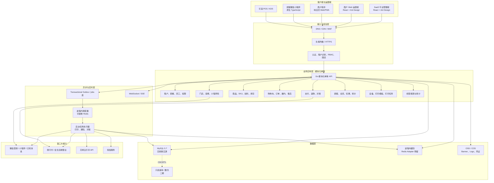
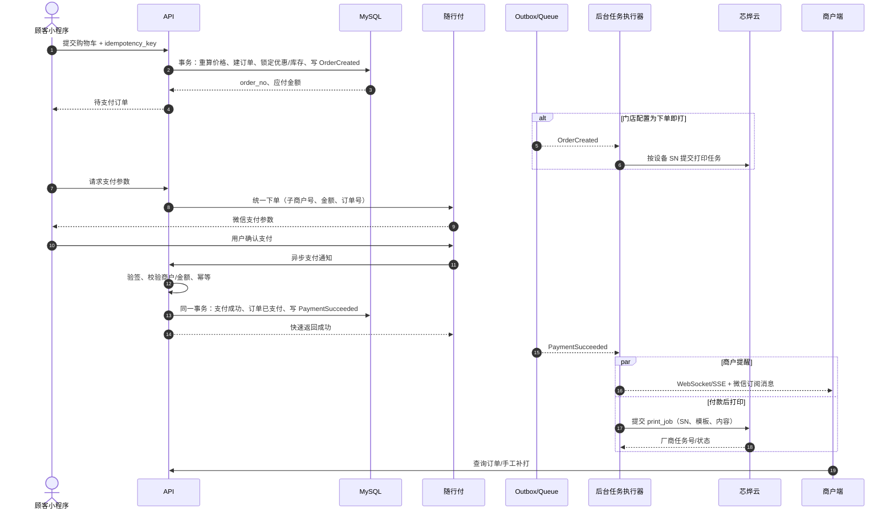
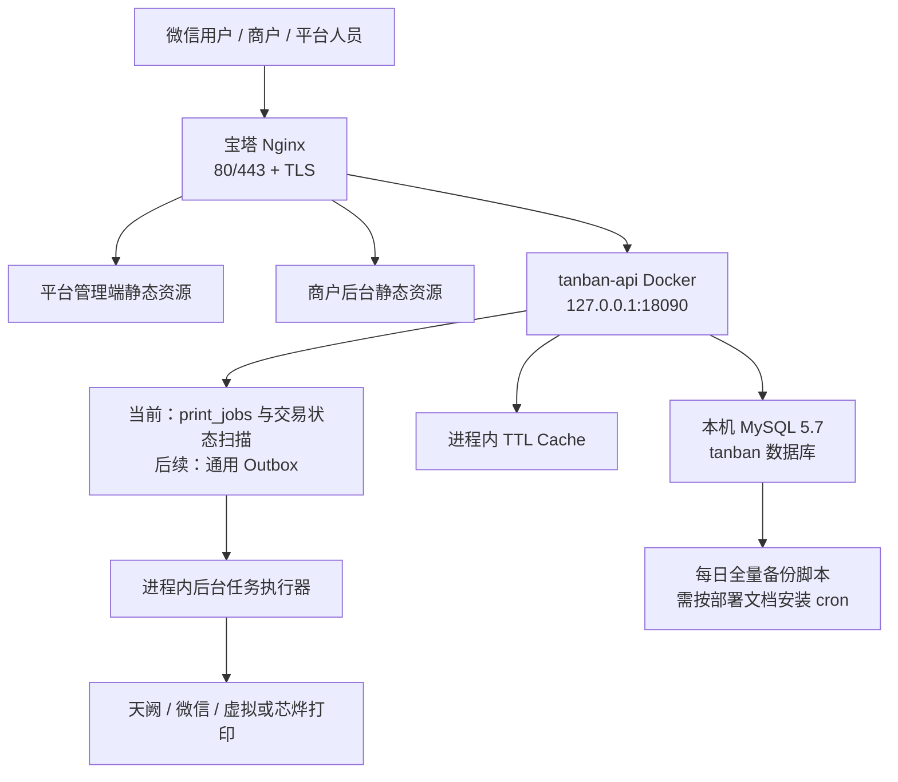

# 摊伴 TANBAN：一期实施架构与目标技术选型

> 版本：v1.2
> 日期：2026-07-19
> 适用范围：平台管理端、商户运营端、商户助手、顾客微信小程序、支付与云打印
>
> v1.2 实施基线：根据首台阿里云服务器和现有 MySQL 5.7 环境，将一期落地栈确定为 Go 模块化单体、MySQL、进程内缓存和数据库任务表；Redis 保留适配能力但暂不部署。
>
> 状态说明：本文同时记录**当前已实现基线**和**后续目标**。未明确写“已实现”的外部服务、实时链路、可观测性与安全增强均不能作为当前上线验收结论；当前交付边界以仓库 README、部署文档和 Provider 文档为准。

## 1. 架构结论

首版采用 **Go 模块化单体 API + MySQL 5.7 + 进程内缓存 + 数据库任务表**，不直接拆微服务，也不把 Redis 作为启动依赖。

原因是餐饮 SaaS 的订单、支付、退款、库存、打印彼此存在强事务关系。首版拆成大量微服务会引入分布式事务、链路追踪、部署和排障成本，但不会直接增加商户价值。Go 模块化单体便于单机交付和排障；当前已有 `print_jobs`、进程内 Cache 接口及第三方 Provider 边界，通用 Outbox、Redis 实现和独立 Worker 属于后续能力。

目标架构不是当前原型的简单扩展：

- 当前仓库的 Next.js/React 页面继续作为交互与视觉基础。
- 正式交易数据不使用当前空的 D1 Schema；核心数据进入服务器现有 MySQL 5.7。
- 当前 Mock 支付成功后在事务中创建 `print_jobs`，支付/退款补偿器扫描交易状态；真实回调验签、通用通知 Outbox 和日终对账尚待真实 Provider 与后续版本实现。
- 一期缓存使用带 TTL 的进程内实现。业务代码只依赖 Cache 接口，扩容到多实例前切换 Redis 实现。
- 支付和打印均通过 Provider 接口隔离。当前可执行实现是 Mock 支付与虚拟打印机；随行付/天阙和芯烨适配器只有边界，尚不能处理真实资金或硬件任务。
- 每张核心业务表都带 `tenant_id`，门店业务表同时带 `store_id`，从模型层落实租户隔离。

## 2. 总体技术架构图

下图是产品演进目标图，不是当前进程/组件清单。当前一期实际部署只有两个静态 Web、原生小程序源码、一个 Go API、MySQL、进程内缓存及 API 内打印/支付/退款 Worker；WAF、对象存储、会员、实时通道、通用 Outbox、短信和数仓均为后续项。



### 2.1 各进程的责任

| 进程 | 责任 | 不承担的责任 |
| --- | --- | --- |
| `web-admin` | 平台管理端与商户运营端 UI | 不直接写数据库，不处理支付回调 |
| `web-merchant` | 商户助手/PWA，可与 Web Admin 共用组件 | 不保存最终订单状态 |
| `miniapp-customer` | 扫码识店、点单、支付拉起、进度查询 | 不自行判定支付成功 |
| `api` | 鉴权、租户识别、业务校验、事务写入、查询 API | 不等待打印机或短信完成 |
| `background runner` | 当前在 API 进程内处理打印重试、支付/退款查单和未支付库存占用超时 | 不参与 HTTP 鉴权和页面响应；通知与日终对账仍待补齐 |
| `realtime`（后续） | 规划用于新订单、支付和打印状态推送；当前未部署 | 不作为事实数据源 |

一期只部署一个 API 进程，后台执行器是其中的独立模块。当前按单实例设计，依赖状态条件和幂等约束恢复任务，尚没有可支持多 Worker 竞争的统一租约框架；扩为多实例前必须补齐数据库租约或 Redis 派发，再拆分后台执行器。

## 3. 关键业务链路

### 3.1 扫码识别商户

商户二维码不是写死一个网页地址，而是由平台按门店生成小程序码：

```text
scene = qrcode_token（随机、不可枚举、可撤销）
qrcode_token -> tenant_id + store_id + table_id? + channel
```

当前实现支持三种入口：门店 `s=<storeCode>`、堂食桌码 `tc=<opaqueToken>`、快餐码牌 `fp=<opaqueToken>`。后两者已经使用服务端生成的不可猜随机令牌并在下单事务中复核归属；门店码只选择公开门店，不作为权限凭证。平台侧微信 `getUnlimited` 正式小程序码生成仍待接入，详细边界见 `MULTI_TENANT_ONBOARDING_AND_QR.md`。

### 3.2 下单、支付与打印

下图描述接入真实随行付、通用 Outbox、商户实时提醒和芯烨后的目标链路。当前一期用 Mock 确认代替真实收单通知，支付成功事务直接创建 `print_jobs`，商户端没有 WebSocket/SSE，打印由虚拟 Provider 完成。



必须遵守的规则：

1. 小程序支付成功页面只能表示“客户端支付流程返回”，最终状态以服务端验签后的异步通知或主动查单为准。
2. 真实 Provider 接入后，回调接口先完成验签、幂等和数据库事务，再快速响应；打印和通知交给后台任务执行器。
3. 当前已有订单号、建单幂等键、追加式支付尝试、每次尝试独立的 Provider 幂等号和订单级互斥锁；真实回调事件 ID 和更细的打印业务幂等键仍需在对应 Provider 落地时补齐。
4. 通用 Outbox 落地后，业务状态和事件必须在同一数据库事务内写入，避免“状态成功但事件丢失”。
5. 当前补打会生成带 `is_reprint/reprint_of/created_by` 的新任务；接真实打印机前还要验证厂商幂等键、至少一次投递和物理打印状态语义。
6. 未支付订单先在事务中预占库存；达到门店支付时限后，后台任务先关闭仍在进行的 Provider 支付，再归还库存。门店禁止迟付时订单同时关闭；允许迟付时订单保留待支付状态，但再次拉起支付前必须重新预占库存，库存不足则不会向支付机构下单。

### 3.3 订单与支付状态分离

订单状态和支付状态必须分开，不能用一个 `status` 混合表达：

```text
OrderStatus   = PENDING_PAYMENT | PAID | ACCEPTED | PREPARING |
                READY | COMPLETED | CANCELLED | CLOSED | REFUNDING | REFUNDED

PaymentStatus = INIT | PROCESSING | SUCCEEDED | FAILED |
                PART_REFUNDED | REFUNDED | CLOSED

PrintStatus   = PENDING | DISPATCHING | ACCEPTED | PRINTED |
                FAILED | UNKNOWN | CANCELLED
```

厂商只能返回“任务已接收”时，不得把它伪装成“物理打印成功”；后台要展示最后心跳、厂商响应、尝试次数和失败原因。

## 4. 正式技术选型

### 4.1 前端与小程序

| 范围 | 选择 | 设计理由 |
| --- | --- | --- |
| 平台/商户 Web | React、Vite、TypeScript | 两个管理端独立构建为静态资源，交给宝塔 Nginx 托管，发布和回滚简单 |
| UI | Ant Design + 自有 Layout | 当前管理端已使用；后续可在页面复杂度上升时引入 ProLayout |
| 服务端状态 | 当前页面内请求状态；后续 TanStack Query | 当前未安装 TanStack Query，不能假定已有统一缓存/失效策略 |
| 表单与校验 | 当前 Ant Design Form；后续按需引入 Zod | 当前未安装 React Hook Form/Zod，API DTO 校验仍由两端分别维护 |
| 图表 | 后续 Apache ECharts | 当前未安装，经营首页使用基础统计组件 |
| 顾客端 | **原生微信小程序 + TypeScript** | 首发只有微信，支付、登录、小程序码、订阅消息与平台能力最直接，减少跨端框架兼容层 |
| 商户移动端 | 首版响应式 Web；PWA 后续 | 当前没有 Service Worker/离线安装能力，不能称为已交付 PWA |

不建议首版用 Taro/uni-app 做顾客端。只有明确要求同时发布支付宝、抖音等多个小程序时，跨端收益才可能大于支付和平台 API 兼容成本。

### 4.2 后端

| 范围 | 选择 | 设计理由 |
| --- | --- | --- |
| 运行时 | **Go 1.23** | 与当前 `go.mod` 和 Docker 构建镜像一致；升级版本应单独测试后修改基线 |
| 语言 | Go；当前执行 `go test`/`go vet`，严格 lint 后续接入 CI | 用户熟悉 Go；AI 生成代码也能通过编译器、接口和表驱动测试快速约束 |
| API 框架 | **chi + net/http** | 依赖轻、REST 路由直观，领域模块不被重框架生命周期绑住 |
| API 契约 | REST + OpenAPI 3.0.3（当前覆盖核心接口，后续补全） | 小程序、Web、外部回调均易接入，先不引入 GraphQL；未写入 OpenAPI 的管理路由暂以服务端实现为准 |
| 数据访问 | **database/sql + 参数化 SQL + versioned migrations** | SQL 行为透明，关键订单/支付事务容易审计，避免 ORM 隐式更新 |
| 主数据库 | **服务器现有 MySQL 5.7** | 符合用户现有基础设施；用唯一索引、事务、行锁和金额整数分保证交易正确性 |
| 缓存/锁/队列 | 进程内 TTL Cache + `print_jobs`/交易状态扫描；Redis Adapter 预留 | 当前没有通用 Outbox 或 Redis 连接；扩到多实例前补齐租约/队列 |
| 文件 | 当前只保存 URL；后续阿里云 OSS 或腾讯云 COS | 当前未实现上传、病毒扫描和私有对象存储 |
| 实时 | 当前普通 HTTP 请求；后续轮询、SSE/WebSocket | 当前未交付实时接单通道 |
| 定时任务 | 当前 API 内打印、支付、退款与未支付库存超时 Worker | 通知、日报和多实例租约任务后续实现 |

选择 Go 不是因为 TypeScript 不能完成交易系统，而是当前一期需要在单机上稳定运行、依赖少、方便用户后续亲自排障。模块边界通过 Go package、Service/Provider 接口和租户条件来维持；幂等和状态约束与语言无关，通用 Repository/Outbox 仍是演进方向。

### 4.3 工程、质量与运维

| 范围 | 当前状态 | 后续目标 |
| --- | --- | --- |
| Monorepo | npm workspaces + Go module | 共享契约和 UI 包按需抽取 |
| 单元/集成测试 | Go `testing`、handler/service 测试；Web 使用 Vitest | 增加真实 MySQL 集成测试 |
| Web E2E | 未接入 | Playwright 覆盖登录、下单、退款与权限 |
| 小程序测试 | TypeScript typecheck，人工开发者工具验证 | 微信开发者工具自动化 + 真机回归清单 |
| API 兼容 | 有 OpenAPI 文档，尚无自动 schema diff/Provider contract gate | CI 中增加兼容性检查 |
| 日志 | Go `slog` JSON + request id；字段尚未全面统一 | 统一 `trace_id/tenant_id/store_id/order_no` 与脱敏规则 |
| 可观测性 | `/healthz`、`/readyz`、Docker/Nginx 日志 | OpenTelemetry、云监控、告警和前端异常平台 |
| CI/CD | 当前为人工执行测试和服务器发布脚本 | GitHub Actions：lint、typecheck、test、build、migration check、镜像扫描 |
| 交付 | Docker 单实例 + 静态 release；部署前自动备份 | 灰度/双实例发布和恢复演练 |
| 密钥 | root-only `.env.production`，Git 忽略 | 云 Secret Manager/KMS 与周期轮换 |

## 5. 模块边界

建议目录：

```text
apps/
  platform-web/          SaaS 平台管理端
  merchant-web/          商户运营端与移动响应式页面
  customer-miniapp/      顾客微信小程序
  api/                   Go HTTP、领域模块、后台任务、migration
packages/
  contracts/             前端共享 DTO、事件 schema、错误码（二期抽取）
  ui/                    Web 共享设计系统（二期抽取）
infra/
  docker/                本地开发和镜像
  deploy/                环境清单、IaC、发布脚本
docs/
```

模块间禁止直接访问对方数据表。首版虽在一个数据库中，仍通过模块 Service/Repository 交互。例如 `device` 可以订阅 `PaymentSucceeded`，但不能直接修改 `payments` 表。

### 5.1 Provider 接口

```go
type PaymentProvider interface {
    CreatePayment(context.Context, CreatePaymentInput) (ClientPayParams, error)
    VerifyCallback(context.Context, []byte, http.Header) (PaymentEvent, error)
    QueryPayment(context.Context, string) (PaymentSnapshot, error)
    Refund(context.Context, RefundInput) (RefundResult, error)
}

type PrinterProvider interface {
    BindDevice(context.Context, BindPrinterInput) (DeviceBinding, error)
    Status(context.Context, DeviceIdentity) (DeviceStatus, error)
    Submit(context.Context, PrintPayload) (ProviderPrintTask, error)
    QueryTask(context.Context, string) (ProviderPrintStatus, error)
}
```

适配器负责签名、协议字段和错误码转换；领域层只认识统一事件和错误类型。更换支付或打印厂家时，不改订单状态机。

## 6. 数据与租户隔离

### 6.1 数据库原则

- 金额统一用最小货币单位整数，例如 `amount_fen bigint`，禁止 `float`。
- 平台业务时间统一采用北京时间（`Asia/Shanghai`、UTC+8）：MySQL `DATETIME` 保存北京时间墙上时间，服务端业务判断、筛选输入与客户端展示都按北京时间，页面格式统一为 `YYYY-MM-DD HH:mm:ss`。第三方支付回调仍保留渠道原始时间和原始报文，进入领域模型时归一到北京时间。
- 核心记录优先使用不可变业务编号；当前部分管理和 Mock 接口仍暴露自增 ID，真实公网接口应逐步改为不可枚举 public id/access token。
- `orders` 按时间和租户增长，达到数据量阈值后再按月分区，不提前复杂化。
- 财务和状态变更保留 append-only 审计记录；个人敏感信息加密并限制查询范围。

### 6.2 三层租户隔离

1. **请求层**：令牌解析出 `tenant_id`，不接受前端任意指定租户。
2. **Repository 层**：所有查询必须自动附加 `tenant_id`；越权测试覆盖所有接口。
3. **数据库层**：MySQL 不提供 PostgreSQL 式 RLS，因此使用强制 `tenant_id` 查询模板、复合唯一索引、接口越权测试和平台运维独立角色作为纵深防御。

推荐的核心唯一约束包括：

```text
unique(tenant_id, order_no)
unique(payment_provider, provider_trade_no)
unique(tenant_id, idempotency_key, operation)
unique(provider, device_sn)
unique(print_job_id, attempt_no)
unique(outbox_event_id)
```

## 7. 部署拓扑

一期部署在用户提供的中国大陆单台云服务器，由宝塔 Nginx 终止 TLS、托管两个管理端静态资源并反向代理 Go API。MySQL 使用同机已有实例，只监听受控网络；API 只监听回环地址。Cloudflare Worker 继续作为历史交互原型的演示环境，不承载正式交易。



一期接受单机故障域，目标是尽快跑通产品和真实支付联调。仓库已提供部署前/每日全量备份脚本，但 cron 需要按部署文档安装，当前没有 binlog 时间点恢复，也没有异机容灾；上线收费前应至少增加加密异机备份、binlog 归档和恢复演练。出现以下任一条件时再引入第二台 API、托管 Redis、数据库高可用或拆服务：

- API/Worker 需要独立且频繁弹性扩容。
- 单模块发布频率或故障已经影响整套系统。
- 研发团队按领域形成多个自治小组。
- 单库热点经优化、分区和只读副本后仍无法承载。

## 8. 可靠性与安全基线

### 8.1 可靠性目标

| 指标 | 首版目标 |
| --- | --- |
| 核心下单/查单 API 月可用性 | 当前单机未建立 SLO 监测；真实营业目标 99.9% |
| 支付回调确认 | 数据库事务完成后尽快返回，禁止等待打印/通知 |
| 支付回调重复处理 | 结果一致，不能重复记账、重复变更订单 |
| 打印任务 | 当前有有限次数后台重试、手工补打和任务记录；指数退避与厂商物理打印确认仍待完善 |
| RPO/RTO | 安装每日备份后理论 RPO ≤ 24 小时；RTO 尚未演练、不作承诺。接入 binlog/异机备份并演练后再设 RPO ≤ 5 分钟、RTO ≤ 60 分钟目标 |
| 告警 | 当前未接告警平台；回调验签异常、金额不符、任务堆积、打印失败率、数据库连接耗尽均为上线目标 |

### 8.2 安全基线

当前已实现 JWT 鉴权、角色校验、租户条件、bcrypt 密码、登录失败限流、CORS 白名单、关键平台/商户操作审计，以及 root-only 环境文件。以下项目是**真实营业上线目标，当前不能视为已完成**：

- 短期 Access Token + 可轮换 Refresh Token，高权限账号 MFA 和会话吊销。
- 顾客端通过 `wx.login` 换取服务端会话；OpenID、session key 不回传日志。
- 真实支付回调的 RSA 验签、时间戳/商户号/订单号/币种/金额核对和防重放。
- 身份证、银行卡、手机号等字段分级、加密、脱敏、最小权限访问和完整审计。
- 商户上传文件的 MIME/扩展名双检、病毒扫描、私有桶和临时签名 URL。
- 退款、补打、设备解绑、支付配置等所有高风险操作的完整审计覆盖和异常告警。
- 依赖、镜像和密钥定期扫描；生产数据库使用独立最小权限账号并禁止共享。

## 9. 研发阶段建议

### 阶段 A：可交易 MVP

当前已完成统一小程序骨架、租户/门店、商品 SKU、购物车、订单、Mock Provider、虚拟打印、商户履约、部分退款和基础审计。阶段 A 剩余项是微信登录/会话、随行付真实验签链路、芯烨硬件适配、订阅提醒、对账与上线安全验收。此阶段坚持一个 Go API 和一个 MySQL 数据库；Redis 暂不启用。

### 阶段 B：可运营 SaaS

补齐套餐计费、员工权限、装修模板、优惠券/会员、库存、经营报表、工单、设备运维和自动化商户进件。

### 阶段 C：规模化

引入只读副本/数仓、事件流平台、灰度发布、多地域容灾。优先拆出通知、打印或报表这类天然异步模块；支付与订单在没有明确瓶颈前仍可保持同一事务边界。

## 10. 明确不选的方案

| 方案 | 当前不选原因 |
| --- | --- |
| 一开始全面微服务 | 团队和流量尚未证明需要，分布式一致性与运维成本过高 |
| Next.js Route Handler 承载全部交易后端 | 适合 BFF/轻接口，不适合作为支付、订单、定时任务和设备任务的唯一组织方式 |
| Cloudflare D1 作为正式交易主库 | 当前原型可用，但大陆生产可达性和支付回调路径不符合本次服务器部署方案 |
| 客户端轮询决定支付成功 | 客户端结果不可信，必须由服务端回调验签或主动查单确认 |
| API 同步等待打印结果 | 厂商或网络故障会拖垮下单/回调接口，且无法可靠补偿 |
| 首版自研支付清结算 | 商户直接签约持牌收单机构更符合当前模式，SaaS 不应形成资金池 |
| 一开始上 Kubernetes/Kafka | 解决的是规模问题；一期用 Docker、`print_jobs`/状态扫描和进程内执行器足够，通用 Outbox 按通知可靠性需求补齐 |

## 11. 与当前仓库的迁移关系

当前仓库根目录保留上一版 Next.js 三端交互原型作为产品和视觉参考；正式代码放在 `apps/` 下，部署时不依赖原型运行时。实施次序如下：

1. 建立 `platform-web`、`merchant-web`、`customer-miniapp` 和 `api` 四个正式应用。
2. 先打通 MySQL 租户、商品、订单和任务表，不再让演示状态充当真实数据。
3. 接入 Mock Payment/Printer Provider，完整验证状态机、幂等、退款和补打。
4. 用沙箱或测试商户接入随行付；完成验签、重复通知、金额不符和主动查单测试。
5. 接芯烨测试设备，覆盖断网、缺纸、重复任务、厂商超时和人工补打。
6. 最后把门店支付 Provider 从 Mock 切换为天阙，并以真实扫码、支付、接单、打印、退款、对账作为上线验收链路。

该路径保留现有原型价值，同时避免在原型运行时和空 Schema 上继续堆叠不可验证的交易逻辑。
